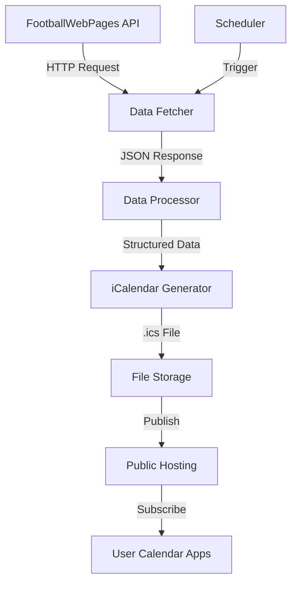

# System Patterns: Larkhall Athletic Fixtures Calendar

## System Architecture

The Larkhall Athletic Fixtures Calendar follows a simple, robust architecture designed for reliability and minimal maintenance:

## Core Components

### 1. Data Fetcher
- **Purpose**: Retrieve raw fixture data from the FootballWebPages API
- **Pattern**: API Client
- **Key Functions**:
  - Authenticate with API using provided key
  - Make HTTP requests to fixtures endpoint
  - Handle API response codes and errors
  - Return raw JSON data

### 2. Data Processor
- **Purpose**: Transform raw API data into structured fixture information
- **Pattern**: Transformer/Adapter
- **Key Functions**:
  - Parse JSON response
  - Extract relevant fixture details
  - Filter for upcoming fixtures
  - Normalize data format
  - Handle edge cases (TBD fixtures, cancelled matches)

### 3. iCalendar Generator
- **Purpose**: Convert structured fixture data into standard iCalendar format
- **Pattern**: Builder
- **Key Functions**:
  - Create iCalendar objects
  - Add calendar metadata
  - Convert each fixture to iCalendar events
  - Generate compliant .ics file

### 4. File Storage
- **Purpose**: Persist the generated calendar file
- **Pattern**: Repository
- **Key Functions**:
  - Write .ics file to storage
  - Version control integration
  - Backup previous versions

### 5. Public Hosting
- **Purpose**: Make the calendar publicly accessible
- **Pattern**: Content Delivery
- **Key Functions**:
  - Serve .ics file via HTTPS
  - Ensure high availability
  - Provide stable URL

### 6. Scheduler
- **Purpose**: Trigger regular updates
- **Pattern**: Cron/Scheduled Task
- **Key Functions**:
  - Run at scheduled intervals (daily)
  - Initiate update process
  - Log execution results

## Data Flow

1. **Acquisition**: Scheduler triggers Data Fetcher to call the API
2. **Transformation**: Data Processor converts API response to structured format
3. **Generation**: iCalendar Generator creates .ics file from structured data
4. **Storage**: File is saved to repository with version control
5. **Publication**: Updated file is published to hosting platform
6. **Consumption**: Users' calendar applications sync with the published file

## Error Handling Strategy

The system implements a robust error handling approach:

1. **API Failures**:
   - Retry with exponential backoff
   - Fall back to previous data if API is unavailable
   - Log detailed error information

2. **Data Processing Errors**:
   - Validate data before processing
   - Skip problematic fixtures rather than failing entire update
   - Maintain data integrity with partial updates

3. **Publication Failures**:
   - Verify successful publication
   - Rollback to previous version if publication fails
   - Alert system administrator on critical failures

## Update Mechanism

The calendar update process follows these steps:

1. **Scheduled Trigger**: Daily execution via GitHub Actions
2. **Data Refresh**: Fetch latest fixture data
3. **Differential Update**: Compare with existing data to identify changes
4. **File Regeneration**: Create new .ics file with updated information
5. **Version Control**: Commit changes to repository
6. **Publication**: Push to hosting platform
7. **Logging**: Record update details for monitoring

## Security Considerations

1. **API Key Protection**:
   - Store API key as a secure environment variable
   - Never expose key in code or logs

2. **Data Integrity**:
   - Validate all incoming data
   - Ensure no malicious content is included in calendar

3. **Access Control**:
   - Read-only public access to calendar file
   - Restricted write access to update mechanism

## Monitoring and Maintenance

1. **Update Verification**:
   - Log each update attempt
   - Verify file changes reflect actual fixture changes

2. **Error Alerting**:
   - Notify on critical failures
   - Provide diagnostic information

3. **Performance Monitoring**:
   - Track API response times
   - Monitor file size and processing time
